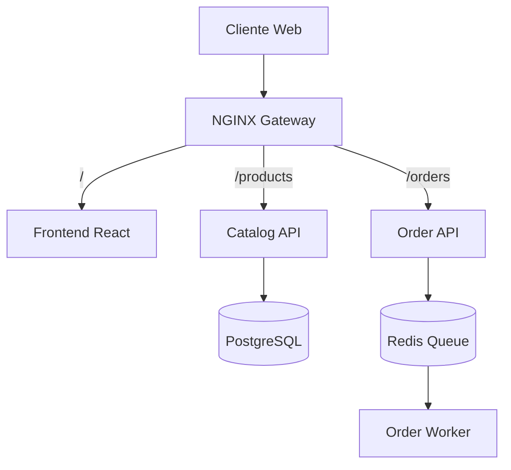

# Relatório Final do Projeto DevOps

## 1. Visão Geral
Este projeto implementa uma arquitetura de microserviços completa para um Sistema de Catálogo e Pedidos, atendendo a requisitos modernos de DevOps como contêinerização, orquestração, integração contínua (CI/CD) e observabilidade.

## 2. Arquitetura da Solução

A solução é composta pelos seguintes componentes:

*   **Frontend (React/Vite):** Interface do usuário para visualização de produtos e criação de pedidos.
*   **API Gateway (NGINX):** Ponto único de entrada que roteia requisições para os serviços adequados.
*   **Catalog Service (Python/FastAPI):** Gerencia o CRUD de produtos, persistindo dados em **PostgreSQL**.
*   **Order Service (Python/FastAPI):** Recebe pedidos e os enfileira para processamento assíncrono.
*   **Message Broker (Redis):** Fila de mensagens para comunicação assíncrona entre API de Pedidos e Worker.
*   **Order Worker (Python):** Processa os pedidos da fila em background.

### Diagrama Lógico


## 3. Tecnologias & Decisões Técnicas

| Componente | Tecnologia | Justificativa |
| :--- | :--- | :--- |
| **Linguagem Backend** | Python 3.12 + FastAPI | Alta performance (async), tipagem forte (Pydantic) e facilidade de desenvolvimento. |
| **Frontend** | React + Vite | Stack moderna, build rápido e componentização eficiente. |
| **Banco de Dados** | PostgreSQL 15 | SGBD relacional robusto e padrão de mercado. |
| **Fila/Cache** | Redis 7 | Baixa latência para mensageria simples e cache. |
| **Container** | Docker | Padronização de ambiente (Multi-stage builds para imagens leves). |
| **Orquestração** | Kubernetes (Minikube) | Gerenciamento de escala, resiliência (Self-healing) e deployment declarativo. |
| **CI/CD** | GitHub Actions | Automação integrada ao repositório, sem necessidade de servidores externos. |
| **Observabilidade** | Prometheus + Grafana | Monitoramento de métricas em tempo real. |

## 4. Checklist de Requisitos Atendidos

### Fundamentos & Setup
- [x] Repositório Git estruturado.
- [x] `docker-compose.yml` funcional para ambiente de desenvolvimento local.
- [x] API Gateway configurado com NGINX.

### Qualidade & Código (12-Factor)
- [x] Configurações via variáveis de ambiente.
- [x] Testes unitários implementados (`pytest`).
- [x] Linting e formatação automática (`ruff`).
- [x] Migrações de banco de dados (`alembic`).

### Infraestrutura & Kubernetes
- [x] Dockerfiles Otimizados (Multi-stage build).
- [x] Manifests Kubernetes (Deployment, Service, Ingress, ConfigMap, Secret).
- [x] **FinOps:** Definição de `requests` e `limits` de CPU/Memória para todos os pods.
- [x] **Resiliência:** Liveness e Readiness Probes configurados.
- [x] HPA (Horizontal Pod Autoscaler) configurado.

### CI/CD (GitHub Actions)
- [x] Pipeline de Build & Push para Docker Hub.
- [x] Pipeline de Testes Automatizados (CI).
- [x] Pipeline de Segurança (Image Scanning com **Trivy**).
- [x] CD (Continuous Deployment) automático para ambiente Cloud (via SSH).

### Observabilidade
- [x] Stack Prometheus e Grafana configurada via Docker Compose.

## 5. Como Executar

### Ambiente Local (Docker Compose)
Para subir todo o ambiente localmente:
```bash
docker-compose up --build
```
Acesse: `http://localhost`

### Ambiente de Produção (AWS/Kubernetes)
Consulte o guia detalhado em [docs/DEPLOY_AWS.md](docs/DEPLOY_AWS.md).

## 6. Evidências de Qualidade

1.  **Cobertura de Testes:** Os testes rodam a cada commit no GitHub Actions.
2.  **Segurança:** O Trivy escaneia vulnerabilidades críticas nas imagens Docker antes do deploy.
3.  **Monitoramento:** O Grafana (porta 3001) permite visualizar a saúde dos containers.

